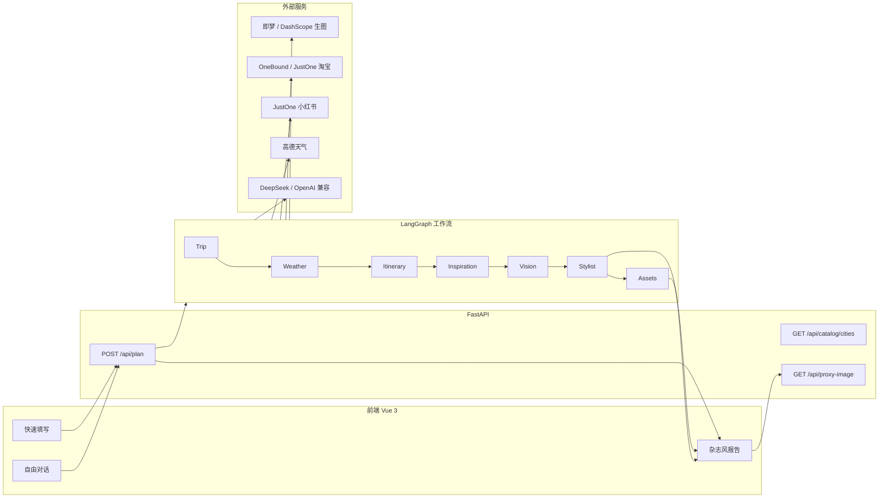
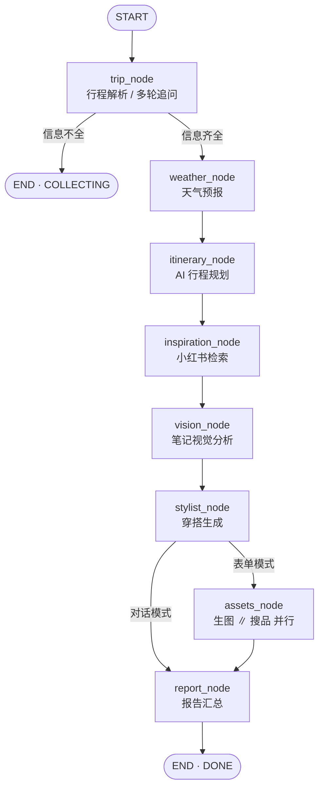

# Travel Outfit Planning Assistant

**旅行穿搭规划助手** — 基于 LangGraph 的多 Agent 智能系统，将「行程 → 天气 → 景点规划 → 小红书灵感 → 穿搭方案 → AI 效果图 → 淘宝商品推荐」串联为按日组织的旅行穿搭报告。

---

## 目录

- [产品定位](#产品定位)
- [核心能力](#核心能力)
- [系统架构](#系统架构)
- [Agent 工作流](#agent-工作流)
- [技术栈](#技术栈)
- [仓库结构](#仓库结构)
- [快速开始](#快速开始)
- [环境变量](#环境变量)
- [API 接口](#api-接口)
- [前端说明](#前端说明)
- [命令行调试](#命令行调试)
- [Streamlit 调试入口](#streamlit-调试入口)
- [测试与质量](#测试与质量)
- [外部服务依赖](#外部服务依赖)
- [相关文档](#相关文档)

---

## 产品定位

用户在计划旅行时，通常需要分别查天气、看攻略、想穿搭、再在淘宝搜商品。本项目提供 **一站式 AI 穿搭规划**：

1. 输入目的地、日期、风格偏好、景点与预算
2. 系统按天输出：天气预报、旅行提醒、穿搭理由、单品清单
3. 可选生成 **AI 搭配效果图**（景点背景合成）
4. 展示与穿搭匹配的 **淘宝商品推荐**（按品类分组，支持预算约束）
5. 引用 **小红书穿搭笔记** 作为灵感来源（搜索 + 视觉分析）

**交付形态**：Vue 3 前端 + FastAPI 后端（推荐）；Streamlit 保留作后端调试入口。

---

## 核心能力

| 能力 | 说明 |
|------|------|
| **双模式输入** | 「快速填写」表单模式 / 「自由对话」多轮补全行程 |
| **多轮对话收集** | 行程信息不全时，Trip Agent 追问目的地、日期、风格等，状态可跨轮传递 |
| **按日行程规划** | 根据用户选定景点，自动或手动分配每日 POI，并做路线评分 |
| **小红书灵感检索** | Outfit Query Compiler 分层编译搜索词，检索笔记并过滤非穿搭内容 |
| **视觉分析** | Vision Agent（Qwen-VL 等多模态模型）从笔记图片提取单品、配色、风格趋势 |
| **穿搭生成** | Stylist Agent 结合天气、行程、身材偏好与 XHS 趋势，结构化输出每日穿搭 |
| **AI 生图** | 即梦（Jimeng）/ 通义万相生成景点背景下的搭配效果图，支持 i2i 参考小红书图 |
| **商品匹配** | 规则打分（关键词、颜色冲突、销量、预算）+ Top-N 选品，不让 LLM 直接调电商 API |
| **杂志风报告** | 前端按日 Tab 展示概要、推荐商品、XHS 参考链接、评分与旅行贴士 |
| **会话历史** | 浏览器 localStorage 保存规划会话，支持回看与删除 |
| **API 录制回放** | 外部 API 请求/响应可录制到本地，便于调试与 Mock |

---

## 系统架构



**数据流概要**：

- 前端通过 `POST /api/plan` 发送用户消息及可选的 `PlanningState`（多轮状态）
- FastAPI 调用 `run_planning()` 执行 LangGraph
- 返回完整 `PlanningState`，其中 `report` 字段为前端渲染用的 `TravelReport`
- 外部 CDN 图片（淘宝/小红书/即梦）经 `/api/proxy-image` 代理，避免浏览器防盗链

---

## Agent 工作流

LangGraph 状态图（`backend/src/graph/workflow.py`）：



### 节点说明

| 节点 | 职责 | LLM | 外部 Tool |
|------|------|-----|-----------|
| `trip_node` | 解析自然语言/表单为 `TripContext`，信息不足时生成追问 | ✅ | — |
| `weather_node` | 拉取行程日期范围内的每日天气 | ❌ | 高德 Web Service |
| `itinerary_node` | 景点分配到每日，路线评分选优 | ✅（可选） | 规则 + `route_scorer` |
| `inspiration_node` | 分层编译 XHS 搜索词，检索穿搭笔记 | ❌ | JustOne 小红书 API |
| `vision_node` | 分析笔记封面/详情图，提取单品与趋势 | ✅（多模态） | 图片下载 |
| `stylist_node` | 结合天气、行程、XHS 趋势生成 `DailyOutfit` | ✅ | — |
| `assets_node` | **并行**执行 `image_node` + `shopping_node` | ❌ | 即梦 / 淘宝搜索 |
| `report_node` | 组装 `TravelReport`：贴士、商品分组、XHS 引用 | ❌ | 规则 enrichment |

### 条件分支

- **Trip 后**：`phase=COLLECTING` 时图结束，等待用户下一轮输入
- **Stylist 后**：`input_mode=chat` 跳过 `assets`（不生图、不搜淘宝），直接出文字报告；`form` 模式走完整链路

### 共享状态 `PlanningState`

核心字段（`backend/src/graph/state.py`）：

- `messages` — 对话历史
- `trip` — 结构化行程（目的地、日期、偏好、预算、避雷项等）
- `weather` / `itinerary` / `outfits` — 天气、每日景点、每日穿搭
- `outfit_inspirations` / `outfit_trends` — 小红书灵感与趋势摘要
- `look_images` / `products` — AI 效果图与商品卡片
- `phase` — `collecting` | `planning` | `done`
- `report` — 最终 `TravelReport`
- `trace` / `errors` — Agent 轨迹与降级记录

---

## 技术栈

| 层级 | 技术 |
|------|------|
| **Agent 编排** | LangGraph、LangChain |
| **LLM** | OpenAI 兼容接口（默认 DeepSeek）；视觉 Qwen-VL（百炼） |
| **后端** | Python 3.11+、FastAPI、Uvicorn、Pydantic v2 |
| **前端** | Vue 3、TypeScript、Vite 6、Vue Router、Pinia |
| **HTTP / 缓存** | httpx、diskcache |
| **包管理** | uv（Python）、npm（前端） |
| **测试 / 规范** | pytest、pytest-asyncio、ruff |
| **可选 UI** | Streamlit（`backend/app/main.py`） |

---

## 仓库结构

```
Travel Outfit Planning Assistant/
├── backend/                      # Python 应用（Agent、API、工具层）
│   ├── api/                      # FastAPI 入口（main.py、schemas.py）
│   ├── app/                      # Streamlit UI 与展示组件
│   │   ├── main.py               # Streamlit 入口
│   │   ├── components/           # 报告卡片、商品网格等
│   │   └── data/                 # 城市/景点目录
│   ├── src/
│   │   ├── graph/                # LangGraph 工作流
│   │   │   ├── workflow.py       # 图编译与 run_planning()
│   │   │   ├── state.py          # PlanningState 与 Pydantic 模型
│   │   │   ├── report.py         # TravelReport 组装模型
│   │   │   └── nodes/            # 各 Agent 节点
│   │   ├── tools/                # 外部 API 封装（weather、onebound、jimeng、xhs…）
│   │   ├── services/             # 业务逻辑（匹配、行程、编译、缓存…）
│   │   ├── prompts/              # Agent Prompt 模板（.md）
│   │   └── config.py             # pydantic-settings 配置
│   ├── tests/                    # 单元 / 集成测试（220+ cases）
│   ├── scripts/                  # 调试脚本
│   ├── pyproject.toml
│   └── .env.example
├── frontend/                     # Vue 3 前端
│   ├── src/
│   │   ├── views/PlanningView.vue
│   │   ├── components/           # 表单、聊天、报告、历史抽屉等
│   │   ├── stores/planning.ts    # Pinia 状态与 API 调用
│   │   ├── api/                  # 类型与 client
│   │   └── utils/                # 格式化、会话历史、图片代理
│   ├── prototypes/               # HTML 原型（历史对话等）
│   └── package.json
├── docs/                         # PRD、技术定案、开发计划、UI 原型说明
└── README.md
```

---

## 快速开始

### 前置要求

- **Python 3.11+** 与 [uv](https://docs.astral.sh/uv/)
- **Node.js 18+** 与 npm
- 至少配置 **LLM API Key**（见下方环境变量）；完整功能需天气、商品、生图等 Key

### 1. 后端

```bash
cd backend
uv sync --extra api --extra dev
cp .env.example .env
# 编辑 .env，至少填写 OPENAI_API_KEY / OPENAI_API_BASE / OPENAI_MODEL
uv run uvicorn api.main:app --reload --port 8000
```

健康检查：http://127.0.0.1:8000/api/health

### 2. 前端

```bash
cd frontend
npm install
npm run dev
```

浏览器打开 **http://localhost:5173**。Vite 将 `/api` 代理到 `http://127.0.0.1:8000`。

### 3. 生产构建（可选）

```bash
cd frontend
npm run build
```

若存在 `frontend/dist`，FastAPI 启动时会自动挂载静态资源，单端口同时提供 API 与前端。

### 最小可运行配置

仅体验对话 + 文字报告（跳过生图与真实商品）：

```env
OPENAI_API_KEY=your-key
OPENAI_API_BASE=https://api.deepseek.com
OPENAI_MODEL=deepseek-chat
PRODUCT_SOURCE=mock
SKIP_IMAGE_GENERATION=true
```

表单模式完整链路还需：`AMAP_API_KEY`、商品源 Key、即梦/通义 Key 等（见 `.env.example`）。

---

## 环境变量

配置文件：**`backend/.env`**（项目会优先加载此文件，覆盖系统环境变量中的同名 Key）。

| 变量 | 说明 |
|------|------|
| `OPENAI_API_KEY` / `OPENAI_API_BASE` / `OPENAI_MODEL` | 主 LLM（Trip、Stylist、Itinerary 等） |
| `VISION_*` | 视觉 Agent（Qwen-VL 等），分析小红书穿搭图 |
| `AMAP_API_KEY` | 高德 Web Service：地理编码 + 天气预报 |
| `PRODUCT_SOURCE` | 商品源：`mock` / `onebound` / `justoneapi` / `scraper` |
| `ONEBOUND_KEY` / `ONEBOUND_SECRET` | 万邦 OneBound 淘宝搜索 |
| `JUSTONEAPI_TOKEN` | JustOne API（淘宝 + 小红书） |
| `SKIP_IMAGE_GENERATION` | `true` 时跳过 AI 生图（加快调试） |
| `IMAGE_PROVIDER` | `jimeng`（即梦）或 DashScope 万相 |
| `VOLCENGINE_*` / `JIMENG_*` | 即梦文生图 / 图生图参数 |
| `DASHSCOPE_API_KEY` | 通义万相备用生图 |
| `IMAGE_USE_XHS_REFERENCE` | 是否用小红书笔记图作 i2i 参考 |
| `API_RECORD_ENABLED` | 是否录制外部 API 请求到 `.cache/api-recordings` |
| `CACHE_DIR` | diskcache 目录 |

完整说明与默认值见 [`backend/.env.example`](backend/.env.example)。

前端可选配置（[`frontend/.env.example`](frontend/.env.example)）：

```env
VITE_USE_API=true
```

---

## API 接口

Base URL：`http://127.0.0.1:8000`（开发时前端经 Vite 代理访问 `/api/*`）

| 方法 | 路径 | 说明 |
|------|------|------|
| `GET` | `/api/health` | 健康检查 |
| `POST` | `/api/plan` | **核心**：执行一轮规划，body 含 `message`、可选 `trip`（表单）、可选 `state`（多轮） |
| `GET` | `/api/catalog/cities` | 城市与景点目录（表单下拉） |
| `GET` | `/api/proxy-image?url=...` | 代理外部 CDN 图片 |
| `GET` | `/api/recordings` | 列出 API 录制记录（调试用） |
| `GET` | `/api/recordings/{id}` | 查看单条录制详情 |

`POST /api/plan` 请求示例（对话模式）：

```json
{
  "message": "7月10日到12日去大理，休闲风，预算单件200以内"
}
```

响应为 `PlanResponse`，其中 `state.report` 含按日 `daily_cards`（天气、穿搭、商品、XHS 参考等）。

OpenAPI 文档：http://127.0.0.1:8000/docs

---

## 前端说明

### 页面

| 路由 | 组件 | 说明 |
|------|------|------|
| `/` | `PlanningView` | 主规划页：左侧输入 + 右侧报告 |

> AI 试衣页（`/tryon`）代码保留在 `frontend/src/views/TryonView.vue`，当前路由与入口已暂时关闭。

### 布局

- **左侧 · 行程输入**
  - **快速填写**：城市、日期、性别、风格、景点、预算、身材、避雷项；支持自动/手动分配每日景点
  - **自由对话**：多轮聊天补全行程，适合自然语言描述
- **右侧 · 报告面板**
  - 按日 Tab：旅行提醒、推荐理由、单品清单、小红书参考、AI 穿搭图
  - 推荐商品 Tab：按品类（上装/下装/鞋/配饰）分组，链接跳转淘宝
- **历史记录**：本地保存会话，可恢复表单草稿与报告快照

### 主要模块

| 路径 | 职责 |
|------|------|
| `stores/planning.ts` | 规划状态、API 调用、会话历史 |
| `components/TripFormPanel.vue` | 表单输入 |
| `components/ChatPanel.vue` | 对话输入 |
| `components/ReportPanel.vue` | 报告容器 |
| `components/MagazineCardInteractive.vue` | 单日杂志风卡片 |
| `utils/sessionHistory.ts` | localStorage 会话持久化 |

---

## 命令行调试

不启动前端，直接跑 LangGraph：

```bash
cd backend

# 完整演示（需 .env 中各 API Key）
uv run python -m src.graph.workflow --demo "7月10-12日去大理，休闲风，预算200"

# 输出完整 JSON 状态
uv run python -m src.graph.workflow --demo "..." --json

# 从 fixture 跳过 Trip LLM，测 weather → report 链路
uv run python -m src.graph.workflow --mock-fixture --demo "继续规划"
```

---

## Streamlit 调试入口

```bash
cd backend
uv run streamlit run app/main.py
```

默认 http://localhost:8501。适合调试 Agent 链路；日常产品体验请用 **Vue + FastAPI**。

若启动时出现 `torchvision` 相关刷屏，已在 `backend/.streamlit/config.toml` 中关闭文件监视；改代码后请在 UI 中手动 **Rerun**。

---

## 测试与质量

```bash
cd backend
uv run pytest              # 220+ 测试用例
uv run ruff check .
uv run ruff format .
```

测试覆盖：工作流路由、Trip 抽取、商品匹配打分、行程规划、XHS 关键词、API 层、节点 Mock 集成等。

商品匹配等模块含 **规则型评分**（颜色冲突、关键词命中、销量、预算），可在 `tests/test_product_matcher.py` 等文件中查看预期行为。

---

## 外部服务依赖

| 服务 | 用途 | 必需程度 |
|------|------|----------|
| DeepSeek / OpenAI 兼容 LLM | 行程解析、穿搭、行程文案 | **必需** |
| 高德 AMap | 天气、城市地理编码 | 表单完整模式推荐 |
| JustOne API | 小红书笔记搜索与详情 | 灵感链路推荐 |
| 万邦 OneBound / JustOne | 淘宝商品搜索 | 商品推荐（可用 `mock`） |
| 即梦 / 通义万相 | AI 搭配效果图 | 可选（`SKIP_IMAGE_GENERATION=true` 跳过） |
| Qwen-VL（百炼） | 小红书图片视觉分析 | 可选（关闭 `VISION_USE_IMAGES` 可降级） |

**设计原则**：

- Shopping 节点 **不让 LLM 直接调用** 电商 API，由确定性代码搜索 + 打分选 Top-N
- 外部 API 失败时写入 `errors` 并 **降级**（如无图、Mock 商品、季节天气估计）
- OneBound 等有调用次数限制，diskcache + `*_MAX_CALLS_PER_RUN` 控制成本

---

## 相关文档

| 文档 | 内容 |
|------|------|
| [docs/PRD.md](docs/PRD.md) | 产品需求、功能范围、页面交互 |
| [docs/TECH-STACK.md](docs/TECH-STACK.md) | 技术选型定案与架构映射 |
| [docs/DEVELOPMENT-PLAN.md](docs/DEVELOPMENT-PLAN.md) | 分阶段开发计划与里程碑 |
| [backend/README.md](backend/README.md) | 后端目录、Phase 说明、API Key 排查 |
| [frontend/README.md](frontend/README.md) | 前端开发与构建 |

---

## 示例输入

**对话模式**：

```
7月10日到12日去大理，女生，休闲风，喜欢拍照，单件预算200以内
```

**表单模式**：选择「大理」、日期范围、勾选洱海/古城等景点，填写风格与预算后点击「开始规划」。

完整链路耗时通常 **1–3 分钟**（取决于 LLM、生图与商品 API 响应）。

---

## License

课程 / 个人学习项目，按需补充开源协议。
