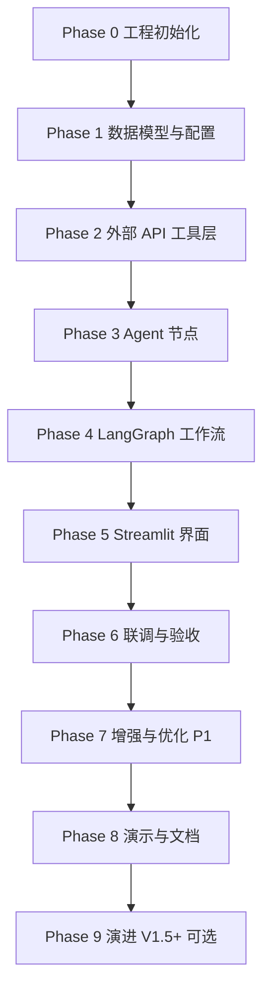
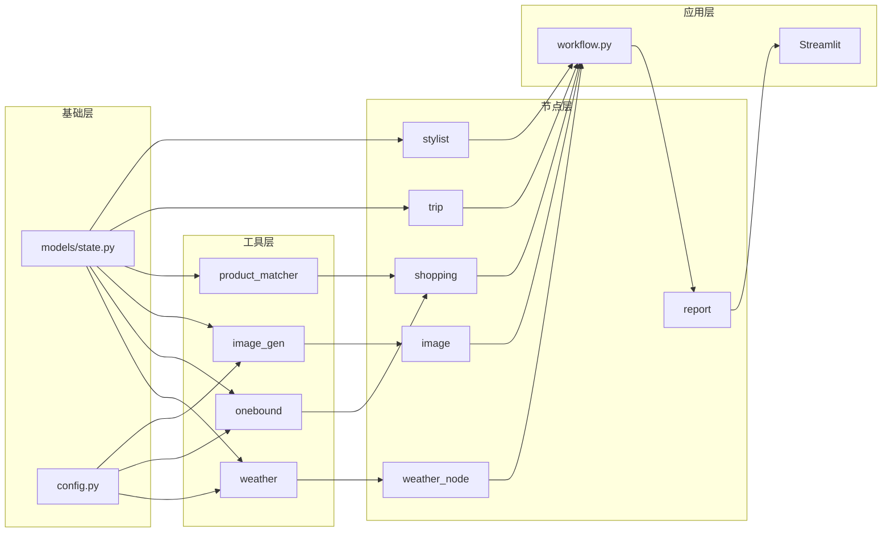

# 旅行穿搭规划助手 — 开发步骤规划

| 项目 | 内容 |
|------|------|
| **文档版本** | v1.0 |
| **创建时间** | 2026-06-02 |
| **依据** | [PRD.md](./PRD.md) v1.1 · [TECH-STACK.md](./TECH-STACK.md) v1.0 |
| **说明** | 不含具体时间，按依赖顺序排列；完成前一阶段验收后再进入下一阶段 |

---

## 1. 规划原则

1. **自底向上**：先数据模型与外部 API 工具，再 Agent 节点，最后 LangGraph 编排与 UI。
2. **先通后优**：每个模块先用 mock 跑通，再换真实 API。
3. **对齐 PRD 六阶段**：① Trip → ② Weather → ③ Stylist → ④ Image ∥ ⑤ Shopping → ⑥ Report。
4. **可演示优先**：每个 Phase 结束都应有一个可运行、可展示的增量结果。

---

## 2. 阶段总览



| 阶段 | 目标 | 阶段结束可演示 |
|------|------|----------------|
| **Phase 0** | 仓库骨架、依赖、环境 | `uv sync` 成功 |
| **Phase 1** | Pydantic 模型、配置加载 | 模型序列化/反序列化通过 |
| **Phase 2** | 天气 / 万邦 / 生图工具可独立调用 | 各工具 CLI 或单测通过 |
| **Phase 3** | 6 个节点各自可运行 | 单节点 mock 输入→输出 |
| **Phase 4** | LangGraph 全链路跑通 | 命令行跑完一次规划 |
| **Phase 5** | Streamlit 双栏 UI | 浏览器完整交互 |
| **Phase 6** | 真实 API 联调 + 降级 | 符合 PRD 验收标准 |
| **Phase 7** | 缓存、日志、Demo 等 P1 | 演示稳定、配额可控 |
| **Phase 8** | README、路演材料 | 可交付课程/作品集 |
| **Phase 9** | FastAPI / React（可选） | 架构演进 |

---

## 3. Phase 0 — 工程初始化

**目标**：搭建 TECH-STACK 定案的目录结构与开发环境。

### 任务清单

- [ ] 初始化 `pyproject.toml`（uv、Python 3.11+、核心依赖）
- [ ] 创建目录结构（`backend/app/`、`backend/src/graph/`、`backend/src/tools/`、`backend/src/services/`、`backend/tests/`、`docs/`）
- [ ] 添加 `backend/.env.example`、`.gitignore`（含 `.env`、`.cache/`）
- [ ] 配置 `ruff`（lint / format）
- [ ] 编写最小 `README.md`（环境要求、安装、运行占位）

### 验收标准

- `uv sync` 无报错
- 目录与 TECH-STACK §6 一致

---

## 4. Phase 1 — 数据模型与配置

**目标**：定义 Agent 间传递的结构化数据，统一读取环境变量。

### 任务清单

- [ ] `src/config.py`：`Settings`（LLM、OneBound、QWeather、DashScope、缓存路径等）
- [ ] `src/graph/state.py`：Pydantic 模型
  - `TripContext`
  - `DailyWeather`
  - `DailyOutfit`（含 `outfit_summary`、`search_keywords[]`、品类描述）
  - `OutfitLookImage`（`date`、`image_url`、`prompt`）
  - `ProductCard`（`title`、`pic_url`、`price`、`detail_url`、`num_iid`）
  - `TraceEvent`
  - `PlanningState`（TypedDict 或 Pydantic 包装）
- [ ] `src/graph/report.py`（仅数据结构）：`TravelReport` / `DailyReportCard` 组装模型

### 验收标准

- [ ] 用 fixture JSON 做 round-trip 测试（model → dict → model）
- [ ] 缺必填 env 时有清晰报错

### 依赖

- Phase 0

---

## 5. Phase 2 — 外部 API 工具层

**目标**：三类外部能力可 **独立调用**，不依赖 LangGraph。

### 2.1 天气工具

- [ ] `src/tools/geocode.py`：`resolve_city(name) -> location_id`
- [ ] `src/tools/weather.py`：`fetch_daily_weather(city, start, end) -> list[DailyWeather]`
- [ ] 失败降级：返回 `None` + 错误信息，供上层用季节兜底

### 2.2 万邦 OneBound 工具

- [ ] `src/tools/onebound.py`：`search_taobao_items(keyword, max_price, page) -> list[dict]`
- [ ] 解析 `error_code == "0000"`，映射为 `ProductCard` 字段
- [ ] `src/services/cache.py`：diskcache 封装（关键词 + 价格区间，TTL 24h）

### 2.3 商品匹配服务

- [ ] `src/services/product_matcher.py`：
  - 多 keyword 候选池合并
  - 按 `num_iid` 去重
  - 匹配分（标题命中、预算、可选销量）
  - `pick_top_n(candidates, outfit, n=5) -> list[ProductCard]`

### 2.4 AI 生图工具

- [ ] `src/tools/image_gen.py`：`generate_outfit_look(prompt) -> image_url | bytes`
- [ ] `src/prompts/image.md`：flat lay 模板（无清晰人脸、无文字 logo）
- [ ] 失败返回 `None`，不抛 uncaught exception

### 2.5 单测（建议同步写）

- [ ] `tests/test_onebound.py`（mock httpx 响应）
- [ ] `tests/test_product_matcher.py`（纯逻辑，无 API）
- [ ] `tests/test_weather.py`（mock）

### 验收标准

- [ ] 各工具可用 `pytest` 或临时脚本单独验证
- [ ] OneBound 用你的 key 能返回 ≥1 条商品
- [ ] 生图 API 能返回 1 张测试图

### 依赖

- Phase 1

---

## 6. Phase 3 — Agent 节点（逐节点实现）

**目标**：每个 PRD Agent 对应一个 `nodes/*.py`，输入输出符合 `PlanningState`。

建议顺序（由简到难、由无 LLM 到有 LLM）：

### 3.1 `weather_node`

- [ ] 读 `state.trip`，调 weather + geocode 工具
- [ ] 写 `state.weather`，记录 `trace`

### 3.2 `shopping_node`

- [ ] 读 `state.outfits`（单日或多日循环）
- [ ] 调 onebound + product_matcher，写 `state.products`（每日 ≤5）
- [ ] 实现调用次数上限（`ONEBOUND_MAX_CALLS_PER_RUN`）
- [ ] API 失败：写 `errors`，该日商品为空

### 3.3 `image_node`

- [ ] 读 `state.outfits` + `state.weather`
- [ ] 组装生图 prompt，调 `image_gen`
- [ ] 写 `state.look_images`（1 张/天）
- [ ] 失败：该日无图，不阻断

### 3.4 `stylist_node`

- [ ] `src/prompts/stylist.md`：要求 JSON 输出（`DailyOutfit[]`）
- [ ] LangChain structured output 或 JSON mode
- [ ] 输入：`trip` + `weather`；输出：`outfits`

### 3.5 `trip_node`

- [ ] `src/prompts/trip.md`：解析用户消息 → `TripContext`
- [ ] 校验必填：目的地、出发/返回日期
- [ ] 不全：设置 `phase=collecting`，写入追问消息，**interrupt** 等待用户
- [ ] 齐全：写 `state.trip`，`phase=planning`

### 3.6 `report_node`

- [ ] 合并 `weather` + `outfits` + `look_images` + `products` → `TravelReport`
- [ ] 可选：LLM 生成行程级摘要一句

### 节点开发方式

每个节点先用 **mock state** 单测，再接真实工具：

```
tests/test_nodes/test_shopping_node.py
tests/fixtures/mock_state.json
```

### 验收标准

- [ ] 6 个节点均有单测或脚本验证
- [ ] mock 输入下每个节点输出字段正确

### 依赖

- Phase 2

---

## 7. Phase 4 — LangGraph 工作流编排

**目标**：串起六阶段，支持追问 interrupt、Image/Shopping 并行。

### 任务清单

- [ ] `src/graph/workflow.py`：
  - 定义 `StateGraph(PlanningState)`
  - 注册节点：trip → weather → stylist → (image ∥ shopping) → report
  - 条件边：trip 信息不全 → `END`（interrupt）或回 trip
- [ ] Image 与 Shopping **并行**（LangGraph fan-out / `asyncio.gather` 在节点内）
- [ ] `run_planning(user_message, history) -> TravelReport` 入口
- [ ] 统一写入 `state.trace`（Agent 轨迹面板数据）
- [ ] 命令行调试入口：`python -m src.graph.workflow --demo "大理3日游..."`

### 验收标准

- [ ] CLI 一次运行输出完整 JSON 报告（可先用 mock LLM / mock 外部 API）
- [ ] 信息不全时触发追问，补全后继续
- [ ] 单日报告块包含：天气、文字穿搭、look_image、≤5 products

### 依赖

- Phase 3

---

## 8. Phase 5 — Streamlit 界面

**目标**：实现 PRD §6 双栏布局与交互。

### 任务清单

- [ ] `app/main.py` 布局：左对话（40%）+ 右报告（60%）
- [ ] `st.session_state`：消息历史、当前报告、规划中状态
- [ ] 对话区：输入框、发送、规划中禁用
- [ ] 报告区：
  - 行程摘要条
  - 按天 Tab / 卡片
  - 天气 → 文字穿搭 → AI 图 → 商品网格（≤5）
  - 商品点击跳转 `detail_url`
  - 免责声明
- [ ] 进度步骤条（F-03）：对接 `trace` 或阶段 callback
- [ ] 空态 / 加载态 / 失败占位（PRD §6.3–6.5）
- [ ] P1：`示例行程` 下拉（F-12）、`重新规划`（F-13）

### 验收标准

- [ ] 浏览器内完成：输入 → 追问（可选）→ 报告展示
- [ ] 报告层级与 PRD §6.1 线框一致

### 依赖

- Phase 4

---

## 9. Phase 6 — 联调与 MVP 验收

**目标**：全部真实 API 接通，满足 PRD 成功标准。

### 任务清单

- [ ] 配置真实 `.env`（LLM、OneBound、QWeather、DashScope）
- [ ] 端到端场景测试（对照 PRD §3.2）：
  - 场景 A：信息完整
  - 场景 B：多轮补全
  - 场景 C：OneBound 失败降级
  - 场景 D：生图失败降级
- [ ] 边界用例：
  - 日期无效
  - 1 天 vs 5 天行程
  - 商品不足 5 个
- [ ] 修复 prompt、匹配规则、UI 细节

### MVP 验收清单（PRD §2.4 + §12）

| 项 | 标准 |
|----|------|
| 主流程 | 补全行程后输出多日报告 |
| 视觉 | 每天有 AI 搭配图（或明确失败占位） |
| 商品 | 每天有 ≤5 个真实淘宝链接 |
| 链接来源 | 100% 来自 OneBound，无 LLM 编造 |
| 降级 | 任一 API 失败仍输出部分报告 |
| 演示 | 5 分钟内讲清 Agent 分工 |

### 依赖

- Phase 5

---

## 10. Phase 7 — 增强与优化（P1）

**目标**：提升演示稳定性与可维护性。

### 任务清单

- [ ] OneBound 关键词缓存生效（S-09）
- [ ] 单次行程 API 调用上限与日志（S-10、S-11）
- [ ] Agent 轨迹折叠面板（P-05，PRD §6.7）
- [ ] 生图 prompt 迭代（flat lay 风格统一）
- [ ] 商品匹配规则调参（标题分词、预算权重）
- [ ] 补充 `tests/` 覆盖率（工具层 + matcher）
- [ ] 进度 callback 细化（Streamlit 实时刷新）

### 依赖

- Phase 6

---

## 11. Phase 8 — 演示与交付文档

**目标**：可提交课程 / 作品集 / 路演。

### 任务清单

- [ ] 完善 `README.md`：架构图、环境变量、运行步骤、Demo 输入示例
- [ ] 准备 2–3 条固定 Demo 行程（国内 + 境外各一）
- [ ] 录制或准备路演脚本（Agent 分工 + 数据流 5 分钟版）
- [ ] 检查密钥未入库、`.env.example` 完整
- [ ] （可选）Dockerfile / `streamlit run` 一键脚本

### 依赖

- Phase 6 或 Phase 7

---

## 12. Phase 9 — 演进（可选，PRD V1.5 / V2）

非 MVP 范围，主链路稳定后再做：

| 任务 | 说明 |
|------|------|
| FastAPI 层 | `POST /api/v1/plan`、SSE 进度 |
| Streamlit 改调 API | 前后端分离 |
| React 前端 | 报告卡片、轨迹面板精细交互 |
| F-14 打包清单 | 跨天商品去重汇总 |
| 多平台 | 京东/拼多多 source 扩展 |

---

## 13. 开发顺序依赖图（模块级）



---

## 14. 建议的「最小可运行」里程碑

每完成一步即可提交一次 git（若使用版本管理）：

| 里程碑 | 内容 | 验证方式 |
|--------|------|----------|
| **M1** | Phase 0 + 1 | 模型 + config 测试通过 |
| **M2** | Phase 2 | 三个 API 工具各自可调 |
| **M3** | weather + stylist + report 节点 + 简化图 | CLI 输出文字穿搭（无图无商品） |
| **M4** | + shopping 节点 | CLI 输出带 ≤5 商品 |
| **M5** | + image 节点 | CLI 输出带 AI 搭配图 |
| **M6** | + trip + interrupt | CLI 支持多轮补全 |
| **M7** | Phase 5 Streamlit | 浏览器完整流程 |
| **M8** | Phase 6 验收 | 对照 PRD 场景 A–D |

---

## 15. 风险与开发时注意点

| 风险 | 开发对策 | 对应 Phase |
|------|----------|------------|
| OneBound 配额少 | 先写 cache + 调用上限；Demo 用短行程（1–2 天） | 2、3、7 |
| 生图慢/贵 | Image 与 Shopping 并行；按天 1 张 | 4 |
| LLM JSON 不稳定 | Stylist/Trip 用 structured output + 重试 | 3 |
| Streamlit 长任务阻塞 | `st.status` / 分步刷新 / 异步 | 5 |
| 境外天气不准 | weather 工具预留降级字段 | 2、6 |

---

## 16. 与 PRD 功能 ID 映射

| PRD 功能 | 主要实现阶段 |
|----------|--------------|
| F-01 ~ F-02 对话/追问 | Phase 3 trip_node + Phase 4 interrupt |
| F-03 进度反馈 | Phase 4 trace + Phase 5 UI |
| F-04 ~ F-06 报告/天气/穿搭 | Phase 3 stylist + report + Phase 5 |
| F-07 AI 搭配图 | Phase 2 image_gen + Phase 3 image_node |
| F-08 ~ F-10 商品列表/跳转 | Phase 2 onebound + matcher + Phase 3 shopping |
| F-11 免责声明 | Phase 5 UI |
| F-12 ~ F-13 Demo/重新规划 | Phase 5 / Phase 7 |
| S-01 ~ S-12 系统能力 | Phase 2–7 分散对应 |

---

**下一步建议**：从 **Phase 0 → Phase 1** 开始初始化仓库；若你确认，可直接按本规划创建项目骨架。
