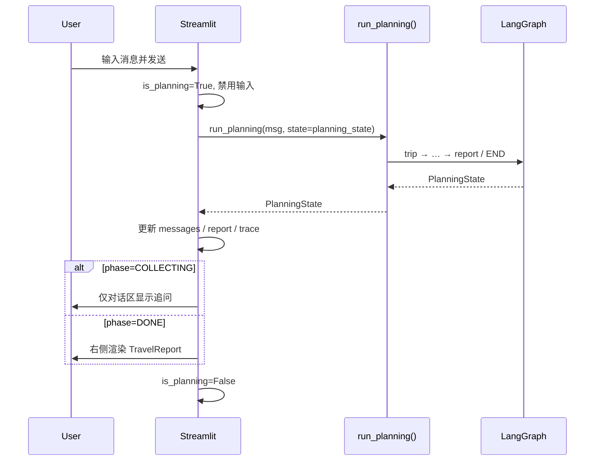

# Phase 5 — Streamlit UI 原型设计

> 目标：在 Phase 4 `run_planning()` 之上，实现 PRD §6 双栏 Web 演示端。  
> 本文档为 **原型设计**（非实现代码），供 Phase 5 开发直接对照。

---

## 1. 产品定位

| 维度 | 说明 |
|------|------|
| 形态 | 单页 Streamlit App（`backend/app/main.py`） |
| 用户路径 | 输入行程 →（可选）多轮追问 → 右侧展示多日穿搭报告 |
| 后端入口 | `from src.graph.workflow import run_planning` |
| 状态来源 | `PlanningState`：`messages`、`report`、`phase`、`trace`、`errors` |

---

## 2. 页面布局（Desktop ≥1024px）

```
┌─────────────────────────────────────────────────────────────────────────────┐
│  🧳 旅行穿搭规划助手                                    [示例行程 ▼] [重新规划] │
├──────────────────────────┬──────────────────────────────────────────────────┤
│  对话区 (40%)             │  报告区 (60%)                                     │
│                          │  ┌─ 行程摘要条 ─────────────────────────────────┐  │
│  ┌────────────────────┐  │  │ 大理 · 7/10–7/12 · 3天 · 休闲风              │  │
│  │ 助手：请告诉我…      │  │  └──────────────────────────────────────────────┘  │
│  └────────────────────┘  │  ┌─ 进度步骤 (F-03) ────────────────────────────┐  │
│  ┌────────────────────┐  │  │ ✓ 行程 ✓ 天气 ● 穿搭 ○ 生图 ○ 商品 ○ 报告   │  │
│  │ 用户：7月10-12…     │  │  └──────────────────────────────────────────────┘  │
│  └────────────────────┘  │  [ Day 1 ] [ Day 2 ] [ Day 3 ]  ← st.tabs           │
│                          │  ┌─ 单日报告卡片 (PRD §6.1) ────────────────────┐  │
│  ┌────────────────────┐  │  │ 🌤 18–26°C 晴  降水 10%                       │  │
│  │ 输入框…      [发送] │  │  │ 【穿搭方案】文字描述…                          │  │
│  └────────────────────┘  │  │ 【搭配效果示意图】AI 大图                       │  │
│  （规划中：输入禁用）      │  │ 【推荐商品】≤5 网格 + 去淘宝购买                 │  │
│                          │  └──────────────────────────────────────────────┘  │
│                          │  ⚠ 免责声明（report.disclaimer）                   │
└──────────────────────────┴──────────────────────────────────────────────────┘
```

**Streamlit 实现映射**

| 区域 | 组件 |
|------|------|
| 顶栏 | `st.columns` + `st.selectbox`（示例）+ `st.button`（重新规划） |
| 主栏 | `st.columns([2, 3])` 或 `layout="wide"` + 自定义 CSS 固定比例 |
| 对话 | `st.chat_message` × N + `st.chat_input` |
| 进度 | `st.progress` 或自定义 HTML 步骤条，数据来自 `state.trace` |
| 报告 | `st.tabs` 按 `report.daily_cards` 日期 |
| 单日卡片 | 嵌套 `st.container(border=True)` |

---

## 3. 组件规格

### 3.1 对话区

| 元素 | 行为 |
|------|------|
| 消息列表 | 渲染 `st.session_state.planning_state.messages` |
| 用户气泡 | `role=user`，右对齐样式（可选 CSS） |
| 助手气泡 | `role=assistant`；追问时仅更新对话，右侧保持空态或上次报告 |
| 输入框 | `st.chat_input("描述你的行程…")` |
| 发送 | 触发 `run_planning(message, state=...)` |
| 规划中 | `st.session_state.is_planning=True` 时禁用输入，显示 `st.spinner` |

**多轮追问（Phase 4 interrupt）**

```
Turn 1: user "下周去云南" → phase=COLLECTING → 助手追问
Turn 2: user "大理，7月10-12" → 完整图跑通 → phase=DONE → 展示 report
```

每次调用必须 **传入上一轮** `PlanningState`，不可清空 `messages`。

### 3.2 进度步骤条

将 `trace` 映射为固定 6 步（与 PRD §6.4 一致）：

| 步骤 | 触发 Agent | 完成条件 |
|------|------------|----------|
| 1 行程信息 | Trip | `trip.is_complete` |
| 2 天气查询 | Weather | trace 含 `Weather` 且非 skipped |
| 3 穿搭规划 | Stylist | `len(outfits) > 0` |
| 4 搭配示意图 | Image / Assets | `len(look_images) > 0` 或已降级 |
| 5 商品匹配 | Shopping / Assets | `len(products) > 0` 或已降级 |
| 6 生成报告 | Report | `report is not None` |

UI 状态：`done` ✓ / `active` ● / `pending` ○ / `error` ⚠（对应 `errors` 或 trace level=warning）。

### 3.3 行程摘要条

数据源：`TravelReport` 或 `PlanningState.trip`

```
{destination} · {start_date}–{end_date} · {trip_days}天 · {preferences.style}
```

可选 chips：`activities`、`budget_per_item`（有则显示）。

### 3.4 单日报告卡片

严格遵循 PRD §6.1 信息层级：

```
天气行 → 穿搭文字 → AI 大图（主视觉）→ 商品网格（≤5）
```

| 区块 | 字段 | 组件 |
|------|------|------|
| 标题 | `card.date` +  weekday | `st.subheader` |
| 天气 | `card.weather` | 温度区间、condition、rain_prob |
| 穿搭 | `card.outfit.outfit_summary` | `st.markdown` |
| AI 图 | `card.look_image_url` | `st.image(url, use_container_width=True)` |
| 商品 | `card.products[]` | 5 列 `st.columns(5)`，每格：图 + 价 + 链接 |

**商品卡片**

- 图片：`product.pic_url`，1:1，`border-radius: 8px`
- 标题：单行省略 `product.title`
- 价格：`¥{product.price}` + 小字「仅供参考」
- 按钮：`st.link_button("去淘宝购买", product.detail_url)` 或 markdown 链接 `target=_blank`

**降级（`card.degraded` 或 `errors`）**

| 场景 | UI |
|------|-----|
| 无 AI 图 | 灰色占位 +「示意图生成失败，可参考上方文字方案」 |
| 无商品 |「暂未匹配到商品」+ 淘宝搜索 fallback 链接 |
| 商品 < 5 | 只展示实际数量，右侧留空，不凑数 |

### 3.5 免责声明

固定展示 `report.disclaimer`（默认文案已在 `TravelReport` 模型中）。

---

## 4. Session 状态模型

```python
# st.session_state 建议结构
{
    "planning_state": PlanningState | None,  # 多轮对话 + 图状态
    "is_planning": bool,
    "selected_example": str | None,          # P1 示例行程
    "last_error": str | None,                # 顶层异常（LLM 不可用等）
}
```

**初始化**（`main.py` 顶部）

```python
if "planning_state" not in st.session_state:
    st.session_state.planning_state = None
if "is_planning" not in st.session_state:
    st.session_state.is_planning = False
```

**重新规划**：清空 `planning_state`、`is_planning`，报告区回到空态。

---

## 5. 交互流程



---

## 6. 页面状态机

| 状态 | 对话区 | 报告区 | 输入框 |
|------|--------|--------|--------|
| **空态** | 欢迎语 + 示例提示 | 插画 +「发送行程后开始规划」 | 可用 |
| **追问中** | 历史 + 助手问题 | 空态或保留旧报告（若重新规划则空） | 可用 |
| **规划中** | 已有历史 | 进度条 + Skeleton 卡片 | **禁用** |
| **完成** | 完整历史 | 多日 Tabs + 卡片 | 可用（可继续对话改行程） |
| **失败** | 错误 toast | 部分报告或空 | 可用 |

---

## 7. 空态 / 加载 / 错误（PRD §6.3–6.5）

### 7.1 空态（首次访问）

```
右侧：
  [插图: 行李箱 + 衣架]
  「告诉我目的地和日期，我来帮你规划每日穿搭」
  快捷示例：大理3日游 | 北京周末 | 东京5日
```

### 7.2 加载态

- 全局：`st.spinner("正在规划…")` 或顶部 progress
- 单日 AI 图：`st.skeleton`（Streamlit 1.33+）或 CSS 脉冲块 +「正在生成搭配示意图…」
- 商品区：5 个灰色方块 skeleton

### 7.3 错误态

| 类型 | 处理 |
|------|------|
| LLM 401/超时 | `st.error` + 检查 `.env` 提示 |
| 天气/OneBound/生图失败 | 不阻断；`state.errors` 在报告区 `st.warning` 折叠展示 |
| 未预期异常 | `st.exception` + 保留 `planning_state` 便于重试 |

---

## 8. P1 增强（可 Phase 5 末或 Phase 7）

| 功能 | PRD | 实现要点 |
|------|-----|----------|
| 示例行程下拉 F-12 | §6 | 预置 3 条 JSON，选中后填入 `chat_input` |
| 重新规划 F-13 | §6 | 按钮清空 session，确认对话框 |
| 图片 Lightbox | §6.3 P1 | `st.dialog` + 大图 |
| 移动端 | — | 窄屏改为上下堆叠：对话在上、报告在下 |

---

## 9. 文件结构（Phase 5 实现时）

```
backend/
├── app/
│   ├── main.py              # Streamlit 入口、session、布局
│   ├── components/
│   │   ├── chat.py          # 对话区
│   │   ├── progress.py      # 步骤条 ← trace
│   │   ├── daily_card.py    # 单日卡片
│   │   └── product_grid.py  # 商品网格
│   └── styles.css           # 可选：40/60 栏、圆角、网格
```

**依赖**：在 `pyproject.toml` 增加 `streamlit` extra；启动：

```bash
cd backend
uv run streamlit run app/main.py
```

---

## 10. 与后端 API 对照表

| UI 展示 | 后端字段 |
|---------|----------|
| 聊天气泡 | `PlanningState.messages[]` |
| 是否还可发送 | `phase != COLLECTING` 或始终可发（追问） |
| 进度步骤 | `PlanningState.trace[]` |
| 行程摘要 | `TravelReport.destination`, dates, `trip.preferences` |
| 按天 Tab | `TravelReport.daily_cards[].date` |
| 天气行 | `DailyReportCard.weather` |
| 穿搭文案 | `DailyReportCard.outfit` |
| AI 图 | `DailyReportCard.look_image_url` |
| 商品 | `DailyReportCard.products` (max 5) |
| 降级提示 | `DailyReportCard.degraded`, `PlanningState.errors` |
| 免责声明 | `TravelReport.disclaimer` |

---

## 11. 验收清单（Phase 5 Done）

- [ ] 浏览器内完成：输入 → 追问（可选）→ 报告展示
- [ ] 布局：左 40% 对话 + 右 60% 报告（宽屏）
- [ ] 单日卡片层级：天气 → 文字 → AI 图 → 商品
- [ ] 商品点击跳转 `detail_url`（新标签）
- [ ] 规划中禁用输入 + 进度反馈
- [ ] 生图/商品失败时降级展示，不白屏
- [ ] 重新规划可清空并重来

---

## 12. 线框（Mobile ≤768px）

```
┌─────────────────────┐
│ 标题 + 示例 + 重规划 │
├─────────────────────┤
│ 对话区（全宽）        │
│ …                   │
│ [输入框]            │
├─────────────────────┤
│ 进度步骤（横向滚动）   │
├─────────────────────┤
│ 报告区（全宽）        │
│ Tab: D1 | D2 | D3   │
│ 单日卡片（全宽）      │
└─────────────────────┘
```

---

**文档版本**：v1.0 · 对应 Phase 4 `workflow.py` + PRD §6
