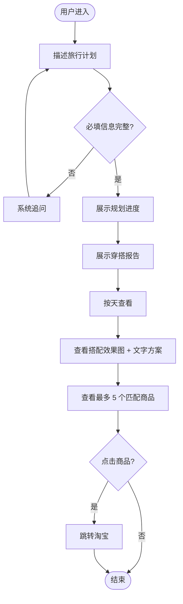
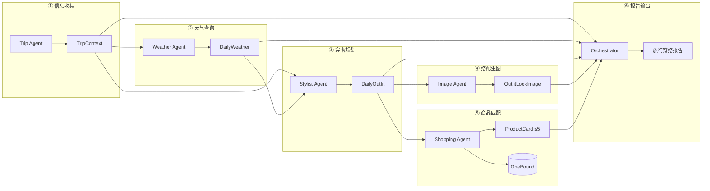
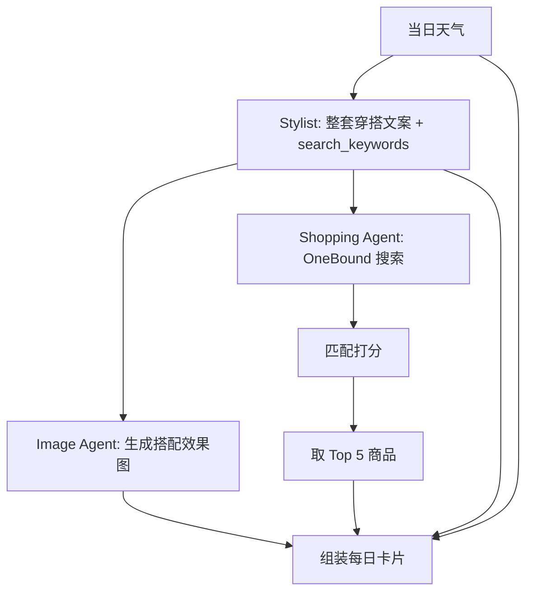
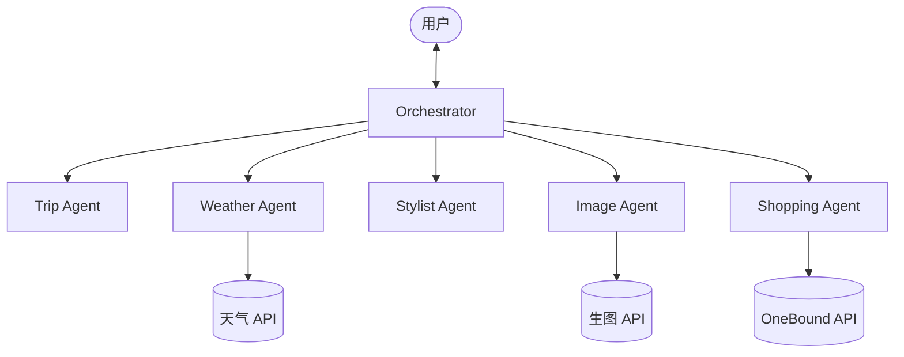

# 旅行穿搭规划助手 — 产品需求文档（PRD）

---

## 1. 文档概述

| 项目 | 内容 |
|------|------|
| **产品名称** | 旅行穿搭规划助手（Travel Outfit Planning Assistant） |
| **文档版本** | v1.1 |
| **创建时间** | 2026-06-02 |
| **最后更新** | 2026-06-02 |
| **产品形态** | 多 Agent 智能助手（Web 演示端，MVP 优先 Streamlit） |
| **相关文档** | 万邦 API 文档：https://open.onebound.cn/help/api/ · [技术架构定案](./TECH-STACK.md) · [开发步骤规划](./DEVELOPMENT-PLAN.md) |

### 1.1 文档目的

本文档从软件产品经理视角，定义「旅行穿搭规划助手」的产品目标、用户场景、功能范围、业务流程与页面交互，作为设计、开发与验收的统一依据。

### 1.2 修订记录

| 版本 | 日期 | 说明 |
|------|------|------|
| v1.0 | 2026-06-02 | 初稿：整合需求讨论、多 Agent 方案、万邦淘宝 API 验证结果 |
| v1.1 | 2026-06-02 | 明确「先穿搭+搭配效果图，后最多 5 个匹配商品」；新增图片方案与 Image Agent；更新流程与页面 |

### 1.3 名词说明

| 名词 | 含义 |
|------|------|
| 穿搭报告 | 系统最终交付物：按天展示天气、穿搭方案、搭配效果图与商品推荐 |
| 搭配效果图 | AI 生成的「整套穿搭穿起来/搭在一起」示意图，非淘宝商品实拍 |
| TripContext | 结构化行程信息（目的地、日期、活动等） |
| DailyOutfit | 单日完整穿搭方案（文字描述 + 搜索关键词） |
| ProductCard | 淘宝商品卡片（主图、标题、价格、详情链接） |
| OneBound | 万邦数据提供的淘宝商品搜索 API 服务 |
| Agent | 承担单一职责的智能体模块（如穿搭规划、生图、商品搜索） |

---

## 2. 产品目标与背景

### 2.1 背景

用户在计划旅行时，普遍面临三类问题：

1. **信息分散**：需自行查天气和攻略，再根据天气和地点规划每天穿什么，效率低且易遗漏。
2. **决策难落地**：通用 AI 可给出文字建议，但缺少 **直观的搭配样子**，也难以对应到可购买的商品。
3. **采购成本高**：即便知道「带一件轻薄外套」，在淘宝搜索时关键词不精准，面对海量结果筛选耗时。

市场上存在天气 App、电商 App、通用聊天机器人，但缺少一款 **将「行程 → 天气 → 穿搭 → 搭配效果图 → 可购商品」串联** 的垂直工具。

### 2.2 产品定位

> 面向旅行者的 **AI 穿搭规划助手**：输入目的地与行程，**先** 输出按天组织的穿搭方案与 **AI 搭配效果图**，**再** 展示与方案最匹配的淘宝商品（最多 5 个，含主图与购买链接）。

### 2.3 核心体验逻辑（v1.1 定案）

每日报告块按 **「先决策、后采购」** 两层呈现：

```
第一层（穿搭决策）  文字穿搭方案 + AI搭配效果图
        ↓
第二层（采购参考）  与搜索结果最匹配的淘宝商品，最多5个
```

- **搭配效果图**：帮助用户快速建立「今天穿什么样」的心智模型。
- **商品列表**：帮助用户找到可购买的近似单品；**商品图与链接均来自 OneBound**，与 AI 图相互独立、互为补充。

### 2.4 产品目标

| 目标类型 | 描述 | 衡量方式 |
|----------|------|----------|
| **核心目标** | 用户一次输入行程，获得可执行的多日穿搭报告 | 主流程完成率 ≥ 80% |
| **视觉目标** | 每天有AI搭配效果图 + 文字方案 | 生图成功率 ≥ 85% |
| **采购目标** | 每天有≤5个可点击的真实淘宝商品 | 有商品链接的天数占比 ≥ 70% |
| **效率目标** | 从提交到出报告 ≤ 3 分钟 | P95 耗时 ≤ 180s |
| **技术目标** | 多 Agent 职责清晰、工具调用可追踪 | 演示 5 分钟内讲清架构 |

### 2.5 非目标（V1 明确不做）

- 用户注册登录、历史行程云端存储
- 个人衣柜管理与「已有单品」约束
- 自动下单、支付、物流
- **AI 虚拟试穿 / 真人换脸**（不做高保真「穿上某 SKU」）
- 保证 AI 效果图与淘宝商品 **100% 同款**（两者定位不同：示意 vs 可购）
- 京东、拼多多等多平台（架构预留，V1 仅淘宝）

---

## 3. 用户与使用场景

### 3.1 目标用户

| 用户画像 | 特征 | 核心诉求 |
|----------|------|----------|
| **普通出游者** | 20–40 岁，国内/出境短中途旅行 | 省心、别穿错、别带太多 |
| **拍照型游客** | 重视出片、风格统一 | 先看搭配样子，再找类似单品 |
| **轻装出行者** | 行李有限、讨厌冗余 | 精准推荐、减少盲目购买 |
| **课程演示观众** | 查看 Agent 项目 | 流程透明、结果直观 |

### 3.2 典型使用场景

#### 场景 A：信息完整，一次生成报告

> 小美计划 7 月 1–5 日去东京观光、逛街，希望休闲风，单件预算 200 元以内。

- **触发**：用户在对话区一次性描述行程
- **过程**：系统确认信息足够 → 查天气 → 规划穿搭 → **生成每日搭配效果图** → 搜索淘宝 → 展示报告
- **结果**：每天看到天气、穿搭文字、**一张搭配效果图**、**最多5个** 匹配商品（图+价+链接）
- **价值**：先「看见怎么穿」，再「买到类似的」

#### 场景 B：信息不全，多轮补全

> 小王说：「下周去云南，帮我看看穿什么。」

- **触发**：缺少具体城市与日期
- **过程**：系统追问 → 用户补全 → 进入场景 A 流程
- **价值**：降低输入门槛，保证推荐质量

#### 场景 C：商品 API 异常，穿搭仍可用

> 搭配效果图已生成，但万邦 API 配额用尽。

- **过程**：保留文字穿搭 + AI 搭配图；商品区显示「暂未匹配到商品」+ 淘宝搜索链接
- **价值**：视觉决策层不依赖电商 API

#### 场景 D：生图 API 异常，商品仍可用

> 万邦正常，但生图服务失败。

- **过程**：保留文字穿搭 + 商品列表；搭配图区显示占位图 +「示意图生成失败」
- **价值**：采购层不依赖生图 API

#### 场景 E：课程/路演演示

> 开发者展示 Multi-Agent 分工：Trip → Weather → Stylist → **Image** → Shopping。

---

## 4. 功能清单

### 4.1 用户侧功能

| ID | 功能 | 描述 | 优先级 |
|----|------|------|--------|
| F-01 | 对话式行程输入 | 用户以自然语言描述旅行计划 | P0 |
| F-02 | 信息补全追问 | 缺目的地/日期时多轮追问 | P0 |
| F-03 | 规划进度反馈 | 展示阶段：天气 / 穿搭 / **生图** / 搜商品 | P0 |
| F-04 | 旅行穿搭报告 | 按天展示完整报告 | P0 |
| F-05 | 每日天气摘要 | 温度、天气现象、降水等 | P0 |
| F-06 | 每日穿搭方案 | 整套穿搭文字说明（品类、理由、风格） | P0 |
| F-07 | **AI 搭配效果图** | 展示「搭在一起的样子」示意图 | P0 |
| F-08 | **匹配商品列表** | 与穿搭最匹配的淘宝商品，**最多 5 个** | P0 |
| F-09 | 商品卡片 | 每个商品含主图、标题、价格、跳转链接 | P0 |
| F-10 | 外链跳转淘宝 | 新标签页打开 OneBound 返回的 `detail_url` | P0 |
| F-11 | 免责声明 | AI 图为示意；商品价/库存以淘宝为准 | P0 |
| F-12 | Demo 一键填充 | 预置示例行程 | P1 |
| F-13 | 重新规划 | 修改行程后重新生成 | P1 |
| F-14 | 打包清单汇总 | 跨天合并推荐商品去重 | P2 |

### 4.2 系统侧功能（Multi-Agent + 工具）

| ID | 模块 | 描述 | 优先级 |
|----|------|------|--------|
| S-01 | Orchestrator Agent | 对话、调度、报告合并、降级 | P0 |
| S-02 | Trip Agent | 解析/补全行程 → `TripContext` | P0 |
| S-03 | Weather Agent | 调用天气 API → `DailyWeather[]` | P0 |
| S-04 | Stylist Agent | 生成 `DailyOutfit[]`（整套描述 + 搜索词） | P0 |
| S-05 | **Image Agent** | 根据 `DailyOutfit` 调用生图 API → `OutfitLookImage` | P0 |
| S-06 | Shopping Agent | 调用 OneBound，匹配并输出 **≤5 个** `ProductCard` | P0 |
| S-07 | 商品匹配规则 | 按标题相关度、预算、销量等打分取 Top 5 | P0 |
| S-08 | 生图 Prompt 模板 | 由 Stylist 结构化字段组装，保证风格一致 | P0 |
| S-09 | API 结果缓存 | 搜索关键词 24h 缓存 | P1 |
| S-10 | 调用次数上限 | 单次行程 OneBound 调用建议 ≤ 3 次/天 | P1 |
| S-11 | Agent 执行日志 | 调试/演示用轨迹 | P1 |
| S-12 | 密钥环境变量管理 | 生图、OneBound、天气 key 不入库 | P0 |

### 4.3 输入字段说明

| 字段 | 必填 | 说明 | 缺失处理 |
|------|------|------|----------|
| 目的地 | 是 | 至少城市级 | 追问 |
| 出发日期 | 是 |  | 追问 |
| 返回日期 | 是 |  | 追问 |
| 活动类型 | 否 | 观光/商务/徒步等 | 默认「通用观光」 |
| 性别 | 否 | 影响穿搭与生图 | 默认「不限」 |
| 风格偏好 | 否 | 休闲/极简/甜美等 | 默认「休闲」 |
| 单件预算 | 否 | 单位：元 | 默认不限制 |

### 4.4 图片与视觉方案

#### 4.4.1 两类图片，职责分离

| 类型 | 来源 | 用途 | 位置 |
|------|------|------|------|
| **搭配效果图** | AI 生图 API | 展示「整套搭在一起的样子」 | 每日卡片 **上部**（主视觉） |
| **商品主图** | OneBound `pic_url` | 展示可购单品 | 每日卡片 **下部**商品列表 |

#### 4.4.2 搭配效果图（AI）

| 项目 | 定案 |
|------|------|
| **生成时机** | Stylist 完成当日穿搭方案 **之后**、Shopping **之前** |
| **输入** | 当日天气摘要 + 完整穿搭描述 + 风格 + 性别 + 目的地场景 |
| **输出** | 1 张/天，宽高比建议 4:3 或 1:1 |
| **风格** | 穿搭平铺图（flat lay）或无清晰人脸的穿搭展示；**不要**写实真人证件照风格 |
| **推荐 API** | 通义万相（国内）或 DALL·E 3（见 TECH-STACK.md） |
| **标注** | 图下注明 *「AI 搭配示意图，仅供参考，非真实商品实拍」* |

#### 4.4.3 商品主图（OneBound）

| 项目 | 定案 |
|------|------|
| **数量** | 每天 **最多 5 个** 商品 |
| **选取逻辑** | 见 §4.4.4 |
| **链接** | 仅使用 API 返回的 `detail_url`，禁止 LLM 编造 |
| **与 AI 图关系** | 商品不必与 AI 图完全一致；列表定位为「可购买的近似单品」 |

#### 4.4.4 商品匹配逻辑（最多 5 个）

```
Stylist 输出：
  · outfit_summary（整套穿搭摘要）
  · search_keywords[]（1～3 个搜索词，覆盖整套或主要品类）
        ↓
Shopping Agent：
  · 对每个 keyword 调用 OneBound（或合并为 1～2 次搜索）
  · 合并候选池，去重（按 num_iid）
  · 按匹配分排序：
      - 标题与 outfit 关键词命中数
      - 价格在 budget 内
      - 可选：销量/评分权重
  · 取 Top 5 写入报告
```

**API 效率**：优先 **1 次综合搜索 + 1 次补充搜索**，避免「每品类搜一次」导致配额耗尽。

### 4.5 外部依赖

| 依赖 | 用途 | 状态 |
|------|------|------|
| 万邦 OneBound `taobao/item_search` | 商品搜索与主图、链接 | 已测试通过 |
| **AI 生图 API** | 搭配效果图（通义万相 / DALL·E 等） | 待接入 |
| 天气 API | 逐日预报 | 待选型 |
| LLM API | Agent 推理与文案 | 待选型 |

---

## 5. 功能流程图

### 5.1 用户主流程



### 5.2 系统处理流程（六阶段流水线）



> **顺序要点**：必须先有 `DailyOutfit`，再 **并行或顺序** 执行 Image（生图）与 Shopping（搜品）；报告层 **先展示穿搭+AI 图，再展示商品列表**。

### 5.3 单日内容生成链路



### 5.4 Multi-Agent 协作关系



**协作原则**：

- 阶段顺序：① → ② → ③ → ④⑤ → ⑥（④ Image 与 ⑤ Shopping 可并行）
- 商品链接 **仅来自 OneBound**
- AI 图 **仅来自生图 API**；与商品图不混用
- 任一步失败走降级，尽量保证报告可输出

---

## 6. 页面说明与交互细节

> V1 采用 **Streamlit 单页**：左侧对话，右侧报告。

### 6.1 单日报告卡片结构（v1.1）

```
┌─ 7月10日 · 周四 ─────────────────────────────────────┐
│ 🌤 18–26°C  晴转多云  降水 10%                          │
│ 💡 今日要点：昼夜温差，建议分层 + 防晒                    │
├────────────────────────────────────────────────────────┤
│ 【穿搭方案】                                            │
│  上装：轻薄长袖防晒衬衫  |  下装：亚麻阔腿裤              │
│  鞋：白色运动鞋  |  配饰：遮阳帽、轻便斜挎包               │
│  风格说明：休闲通勤，适合大理拍照+闲逛                    │
├────────────────────────────────────────────────────────┤
│ 【搭配效果示意图】                          AI 示意 · 仅供参考 │
│  ┌──────────────────────────────────────────────┐      │
│  │           （AI 生成的整套搭配图）              │      │
│  └──────────────────────────────────────────────┘      │
├────────────────────────────────────────────────────────┤
│ 【推荐商品】最多 5 个 · 与穿搭方案匹配的淘宝商品           │
│  ┌────┐ ┌────┐ ┌────┐ ┌────┐ ┌────┐                  │
│  │图1 │ │图2 │ │图3 │ │图4 │ │图5 │   （不足 5 则按实际）│
│  │¥xx │ │¥xx │ │¥xx │ │    │ │    │                  │
│  └────┘ └────┘ └────┘ └────┘ └────┘                  │
│  每个商品：标题（省略）+ 价格 + [去淘宝购买]               │
└────────────────────────────────────────────────────────┘
```

**信息层级**：天气 → 文字穿搭 → **AI 搭配图（主视觉）** → **商品网格（最多 5）**。

### 6.2 商品区交互

| 行为 | 说明 |
|------|------|
| 商品展示 | 横向滚动或 5 列网格；**最多 5 个** |
| 点击商品图/按钮 | 新标签页打开 `detail_url` |
| 价格 | 展示 `promotion_price` 或 `price`，旁注「仅供参考」 |
| 无商品 | 显示「暂未匹配到商品」+ 淘宝综合搜索链接 |
| 不足 5 个 | 按实际数量展示，不凑数 |

### 6.3 搭配效果图交互

| 行为 | 说明 |
|------|------|
| 默认 | 卡片内大图展示 |
| 加载中 | Skeleton 占位 +「正在生成搭配示意图…」 |
| 失败 | 占位图 +「示意图生成失败，可参考上方文字方案」 |
| 点击放大 | P1：Lightbox 查看大图 |

### 6.4 加载/进度态

```
✓ 行程信息已确认
✓ 正在查询大理天气…
● 正在规划每日穿搭…
○ 正在生成搭配效果图…
○ 正在匹配淘宝商品…
○ 正在生成报告…
```

### 6.5 异常与边界态

| 状态 | 展示 |
|------|------|
| 生图失败 | 保留文字穿搭 + 商品列表；搭配图区占位 |
| OneBound 失败 | 保留文字 + AI 图；商品区降级为搜索链接 |
| 两者均失败 | 至少保留文字穿搭 + 天气 |
| 匹配商品 < 5 | 展示实际数量，不填充假数据 |

### 6.6 视觉风格（初步）

| 维度 | 建议 |
|------|------|
| 搭配效果图 | 卡片内全宽，圆角 12px，下方小字免责声明 |
| 商品区 | 5 列等宽网格（移动端 2 列滚动） |
| 商品图 | 1:1，圆角 8px |
| 层级 | AI 图 > 文字方案 > 商品网格 |

---

## 7. 技术架构定案（摘要）

> 完整说明见 [TECH-STACK.md](./TECH-STACK.md)（需同步补充 Image Agent）

| 层级 | MVP 定案 |
|------|----------|
| 主语言 | Python 3.11+ |
| Agent 编排 | LangGraph（含 **Image Agent** 节点） |
| LLM | LangChain + OpenAI 兼容 API |
| **AI 生图** | **通义万相**（国内优先）或 DALL·E 3 |
| 前端 | Streamlit |
| 商品搜索 | 万邦 OneBound `item_search` |
| 天气 | 和风天气 QWeather |

---

## 附录：待确认项

| # | 问题 | 当前定案 |
|---|------|----------|
| 1 | 每天商品数量 | **最多 5 个**（已确认） |
| 2 | 是否先生图再展示商品 | **是**（已确认） |
| 3 | 生图 API 最终选型 | 建议通义万相，可按 Key 调整 |
| 4 | Image 与 Shopping 是否并行 | 建议并行以控制总耗时 |
| 5 | OneBound 套餐 | 是否升级以支撑多日演示 |

---

**文档结束**
