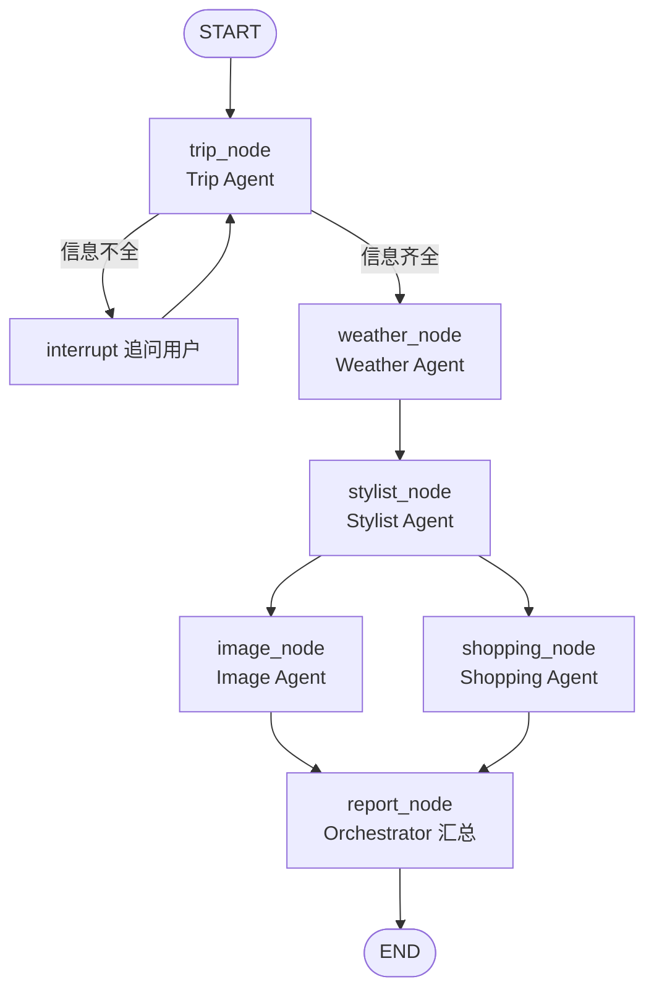

# 旅行穿搭规划助手 — 技术架构定案

| 项目 | 内容 |
|------|------|
| **文档版本** | v1.0 |
| **创建时间** | 2026-06-02 |
| **依据** | [PRD.md](./PRD.md) v1.1 · [开发步骤规划](./DEVELOPMENT-PLAN.md) |
| **状态** | 已定案（MVP），待开发启动 |

---

## 1. 定案总览

| 层级 | 选型 | 语言 |
|------|------|------|
| **主语言** | Python | 3.11+ |
| **Agent 编排** | LangGraph | — |
| **LLM 接入** | LangChain + OpenAI 兼容接口 | — |
| **后端 API（MVP 可选、V1.5 启用）** | FastAPI | Python |
| **前端（MVP）** | Streamlit | Python |
| **前端（V2 演进）** | React + TypeScript + Tailwind CSS | TS |
| **HTTP 客户端** | httpx（async） | Python |
| **数据模型** | Pydantic v2 | Python |
| **配置管理** | pydantic-settings + `.env` | Python |
| **包管理** | uv | — |
| **缓存** | diskcache（本地文件缓存） | Python |

**MVP 交付形态**：**Streamlit 单页应用**，直接调用 LangGraph 工作流（不强制拆前后端服务），以最短路径跑通 PRD 五阶段流水线。V1.5 再抽 FastAPI 层，V2 换 React 前端。

---

## 2. 选型理由（Agent 视角）

### 2.1 为什么主语言选 Python 3.11+

- PRD 五阶段流水线以 **异步 I/O** 为主（天气 API、万邦 OneBound 多次调用），Python `async/await` 成熟。
- 已有 **万邦 / 买手** 搜索脚本为 Python + aiohttp/httpx，迁移成本低。
- LangGraph、LangChain、Streamlit 生态集中在 Python，Multi-Agent 课程演示资料多。
- Pydantic v2 适合 PRD 中的 `TripContext` → `DailyOutfit` → `ProductCard` 结构化传递。

### 2.2 为什么 Agent 框架选 LangGraph

| 对比项 | LangGraph | CrewAI | 纯 OpenAI SDK |
|--------|-----------|--------|---------------|
| 与 PRD 五阶段顺序流水线 | ✅ 状态图节点顺序清晰 | ⚠️ 偏角色对话 | ⚠️ 需自研编排 |
| 结构化状态传递 | ✅ 共享 State 对象 | ⚠️ 较弱 | ⚠️ 自研 |
| 失败降级 / 条件分支 | ✅ 条件边 | 一般 | 自研 |
| 执行轨迹可视化 | ✅ 内置 trace | 有 | 弱 |
| 学习曲线 | 中等 | 较低 | 低但功能少 |

**定案**：**LangGraph** 作为 Orchestrator 实现载体。PRD 中 Trip / Weather / Stylist / Shopping 映射为 **图节点（Node）**，阶段间通过 **共享 State** 传 JSON，Shopping 的 OneBound 调用封装为 **Tool**，由 Shopping 节点内调用（非 LLM 自由调工具，避免乱搜）。

### 2.3 为什么 LLM 用 OpenAI 兼容接口

- 国内常用 DeepSeek、通义、Moonshot 等均兼容 OpenAI API 格式。
- 通过环境变量切换 `OPENAI_API_BASE` + `OPENAI_API_KEY` + `OPENAI_MODEL`，不绑定单一厂商。
- LangChain `ChatOpenAI` 统一封装 Trip / Stylist / Orchestrator 对话节点。

**MVP 默认模型建议**：`deepseek-chat` 或 `gpt-4o-mini`（按已有 API Key 二选一）。

---

## 3. 选型理由（工程视角）

### 3.1 前端：MVP Streamlit，V2 React

| 阶段 | 前端 | 理由 |
|------|------|------|
| **MVP** | Streamlit | PRD 已倾向；双栏对话+报告 1–2 天可搭；纯 Python 团队无割裂 |
| **V1.5** | Streamlit → 调 FastAPI | 前后端分离，便于移动端/第三方接入 |
| **V2** | React + TS + Tailwind | 报告卡片、进度条、Agent 轨迹面板交互更精细 |

**MVP 不引入 Node.js 工具链**，降低环境成本。

### 3.2 后端：MVP 无独立服务，V1.5 FastAPI

- **MVP**：`streamlit run app/main.py` → `from graph.workflow import run_planning` 同步/异步调用 LangGraph。
- **V1.5**：FastAPI 暴露 `POST /api/v1/plan`、`GET /api/v1/plan/{id}/events`（SSE 进度），Streamlit 改调 API。
- **V2**：React 直连 FastAPI。

**定案 API 框架**：**FastAPI**（异步友好、OpenAPI 文档、与 httpx/Pydantic 一致）。

### 3.3 外部 API 客户端：httpx

- 统一 async 调用 **万邦 OneBound**、**和风天气**。
- 较 aiohttp API 更简洁；项目新起，不强制延续 aiohttp（买手脚本逻辑移植即可）。

### 3.4 缓存：diskcache

- OneBound 免费额度约 10 次/日，PRD 要求关键词缓存。
- Key：`hash(keyword + price_range + page)`，TTL 24h，无需 Redis 部署。

### 3.5 包管理与工程规范

| 工具 | 用途 |
|------|------|
| **uv** | 依赖安装、虚拟环境、运行脚本（与 PEP 723 风格一致） |
| **ruff** | Lint + Format |
| **pytest + pytest-asyncio** | 单元测试（工具层、筛选规则） |
| **python-dotenv** | 本地加载 `.env` |

---

## 4. 外部服务定案

| 服务 | 定案 | 用途 | 环境变量 |
|------|------|------|----------|
| **LLM** | OpenAI 兼容 API | Agent 推理 | `OPENAI_API_KEY`, `OPENAI_API_BASE`, `OPENAI_MODEL` |
| **淘宝商品** | 万邦 OneBound `taobao/item_search` | Shopping 节点 | `ONEBOUND_KEY`, `ONEBOUND_SECRET` |
| **天气** | **和风天气 QWeather** | Weather 节点 | `QWEATHER_API_KEY` |
| **地理编码** | 和风天气 GeoAPI（同账号） | 城市名 → Location ID | 同上 |
| **AI 生图** | **通义万相（DashScope）** | Image 节点，搭配效果图 | `DASHSCOPE_API_KEY` |

**天气定案说明**：PRD 场景含国内（大理）与境外（东京），和风天气 Dev 版免费档可覆盖 MVP；境外城市用其 Global 接口或降级为城市气候描述。

**备用**：OpenWeatherMap（`OPENWEATHER_API_KEY`），仅当和风某城市解析失败时切换。

---

## 5. Agent 系统架构映射

### 5.1 LangGraph 状态定义

```python
# 概念结构 — 实现见 src/graph/state.py
class PlanningState(TypedDict):
    messages: list          # 对话历史（Orchestrator / Trip）
    trip: TripContext | None
    weather: list[DailyWeather]
    outfits: list[DailyOutfit]
    look_images: list[OutfitLookImage]  # AI 搭配效果图，按天
    products: list[ProductCard]          # 每日最多 5 个
    phase: str              # collecting | planning | done
    errors: list[str]       # 降级记录
    trace: list[TraceEvent] # Agent 轨迹面板
```

### 5.2 节点与 PRD 阶段对应



| LangGraph 节点 | PRD Agent | LLM 是否参与 | 外部 Tool |
|----------------|-----------|--------------|-----------|
| `trip_node` | Trip | ✅ 解析/追问 | — |
| `weather_node` | Weather | ❌ | QWeather API |
| `stylist_node` | Stylist | ✅ 结构化输出 | — |
| `image_node` | Image | ❌（Prompt 模板 + 生图 API） | 通义万相 / DALL·E |
| `shopping_node` | Shopping | ❌（规则选品 Top 5） | OneBound API |
| `report_node` | Orchestrator | ✅ 摘要文案（可选） | — |

**关键约束**：
- `shopping_node` **不让 LLM 直接调 OneBound**；Shopping 用确定性代码调 API，**每日最多 5 个商品**，按匹配分排序。
- `image_node` 在 Stylist 之后、报告之前；生图与搜品 **可并行**。
- 商品链接仅来自 OneBound；AI 搭配图仅来自生图 API，二者不混用。

### 5.3 Tool 封装清单

| Tool 模块 | 函数 | 调用方 |
|-----------|------|--------|
| `tools/weather.py` | `fetch_daily_weather(city, start, end)` | weather_node |
| `tools/onebound.py` | `search_taobao_items(keyword, max_price)` | shopping_node |
| `tools/image_gen.py` | `generate_outfit_look(prompt) -> url` | image_node |
| `tools/geocode.py` | `resolve_city(city_name)` | weather_node |
| `services/product_matcher.py` | 候选池去重 + 匹配打分 + Top 5 | shopping_node |

---

## 6. 项目目录结构（定案）

```
Travel Outfit Planning Assistant/
├── backend/                    # 所有 Python 应用代码
│   ├── app/
│   │   └── main.py             # Streamlit 入口（对话区 + 报告区）
│   ├── src/
│   │   ├── graph/
│   │   │   ├── state.py        # PlanningState、Pydantic 模型
│   │   │   ├── workflow.py     # LangGraph 编译与 run_planning()
│   │   │   └── nodes/
│   │   │       ├── trip.py
│   │   │       ├── weather.py
│   │   │       ├── stylist.py
│   │   │       ├── image.py
│   │   │       ├── shopping.py
│   │   │       └── report.py
│   │   ├── tools/
│   │   │   ├── onebound.py
│   │   │   ├── weather.py
│   │   │   └── geocode.py
│   │   ├── services/
│   │   │   ├── product_matcher.py
│   │   │   └── cache.py
│   │   ├── prompts/
│   │   │   ├── trip.md
│   │   │   └── stylist.md
│   │   └── config.py
│   ├── tests/
│   ├── pyproject.toml
│   └── .env.example
├── docs/
│   ├── PRD.md
│   └── TECH-STACK.md
└── README.md
```

**V1.5 增量**（均在 `backend/` 下）：

```
backend/
├── api/
│   └── main.py                 # FastAPI 入口
└── web/                        # React 前端（V2）
```

---

## 7. 依赖清单（pyproject.toml 核心）

```toml
[project]
name = "travel-outfit-assistant"
requires-python = ">=3.11"
dependencies = [
    "langgraph>=0.2",
    "langchain-openai>=0.2",
    "langchain-core>=0.3",
    "pydantic>=2.0",
    "pydantic-settings>=2.0",
    "httpx>=0.27",
    "streamlit>=1.35",
    "diskcache>=5.6",
    "python-dotenv>=1.0",
]

[project.optional-dependencies]
dev = ["pytest", "pytest-asyncio", "ruff"]
api = ["fastapi>=0.111", "uvicorn[standard]>=0.30"]
```

---

## 8. 配置与环境变量

`.env.example` 定案：

```env
# LLM（OpenAI 兼容）
OPENAI_API_KEY=
OPENAI_API_BASE=https://api.deepseek.com/v1
OPENAI_MODEL=deepseek-chat

# 万邦 OneBound
ONEBOUND_KEY=
ONEBOUND_SECRET=

# 和风天气
QWEATHER_API_KEY=

# AI 生图（通义万相）
DASHSCOPE_API_KEY=
IMAGE_MODEL=wanx-v1

# 可选
ONEBOUND_MAX_CALLS_PER_RUN=8
CACHE_DIR=.cache
```

---

## 9. 运行与部署（MVP）

| 场景 | 命令 |
|------|------|
| 安装依赖 | `cd backend && uv sync` |
| 本地运行 | `cd backend && uv run streamlit run app/main.py` |
| 测试 | `cd backend && uv run pytest` |

**部署建议**：Streamlit Community Cloud / 单机 Docker / 课程演示本机运行即可；V1 无登录无 DB，无需 K8s。

---

## 10. 版本演进路线

| 版本 | Agent 层 | 后端 | 前端 | 增量 |
|------|----------|------|------|------|
| **MVP** | LangGraph | 无（Streamlit 直连） | Streamlit | 五阶段闭环 + OneBound |
| **V1.5** | LangGraph | FastAPI + SSE | Streamlit 调 API | 进度流式推送、接口化 |
| **V2** | LangGraph | FastAPI | React + TS | 精细 UI、Agent 轨迹面板 |

---

## 11. 不在 MVP 引入的技术

| 技术 | 原因 |
|------|------|
| PostgreSQL / Redis | 无持久化需求 |
| Celery / 消息队列 | 同步等待 1–3 分钟可接受 |
| CrewAI / AutoGen | 编排需求 LangGraph 足够 |
| Next.js | MVP 避免双栈 |
| 浏览器自动化爬淘宝 | 合规与稳定性差 |

---

## 12. 开发分工建议

| 模块 | 负责内容 | 优先级 |
|------|----------|--------|
| `src/graph/*` | LangGraph 工作流与节点 | P0 |
| `src/tools/onebound.py` | 万邦搜索 + 缓存 | P0 |
| `src/tools/weather.py` | 和风天气 | P0 |
| `src/prompts/*` + trip/stylist 节点 | Prompt 与结构化输出 | P0 |
| `app/main.py` | Streamlit 双栏 UI | P0 |
| `services/product_filter.py` | 选品规则 | P0 |
| `tests/*` | 工具层单测 | P1 |
| `api/*` | FastAPI | P2 |

---

**文档结束 — 开发可按本定案直接初始化仓库。**
